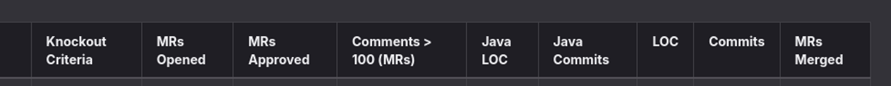

## **Team announcement**
-   Finished code of conduct, great feedback
-   Minutes are good of last week

## **TA announcements**

* Buddy check to do, deadline is Friday 8-03-2024
    * Follow model
    * Don't say anything about others (like he/she was bad etc.)
    * Be polite, constructive etc
    * Follow AID model (check rubric)
-   Ta was happy nobody got knockout email
* You need to approve MR!
    * See below for knockout criteria
-   Advice to use time tracking for milestones and issues

-   Will be taken in account while getting feedback from staff

## **Showing Ta application**

-   Ta was flabbergasted and happy

## **Full stack**

-   Harder to learn, useful to learn
-   We're okay with this approach

## **Conflicts**

-   Some conflicts
-   To avoid, make smaller issues to make it more manageable in proportional time
* Ta says these are normal
    * Merge one by one, merge with main locally, fix issues then is good

-   Merge requests needs to be handled faster
-   Viewer mr's at one
-   Merge more often

## **Extensions**

-   Not for this week
-   This week refine and finish up the basic requirements before we go to extensions

-   Planning is okay, but not working on it is not a problem, especially because of midterms

## **Week planning**

-   Weekly mr meeting didn't happen because people couldn't join
* If meetings are not possible, just approve it after looking at it
    * If mr has 2 approvals merge it

## *Meeting wednesday*

-   Meeting in participant at tu delft in the time of oop lecture
-   11 o clock, ewi floor 21

## **Q from nico**

* Why separate tables for events, expense
    * Rod: idk
    * Teo will look at it

## **Questions for ta**

* App is half screen, how should it be at the end?
    * It is not a hard requirement, optional

* Icons how to fix
    * Ta doesn't know either
    * Track the icon?

**Next chairman: nico-------
Next minutes: teodor**

## **Knockout criteria:**
